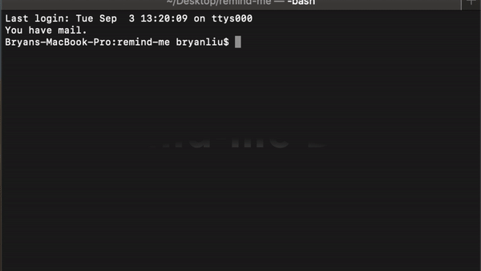
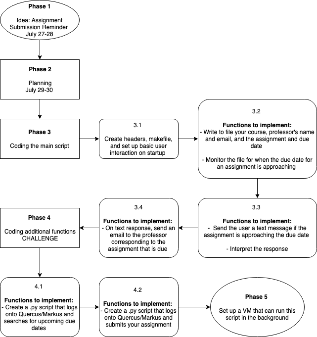

# Remind Me (WIP)

A project created to solve the problem of missing deadlines by integrating C with shell scripting to efficiently monitor due dates and automate submissions.
## Re-work In Progress
Changing language of choice to JS for better library support and ease of deployment for future cloud integration
- [ ] run script with AWS Lambda function polling for new assignments
- [ ] write script to text and notify 
- [ ] script to poll quercus for assignments
- [ ] redesign app workflow
- [ ] add chatbot to reply to

<!--- 

_The demo reflects basic functionality, subject to change_

## Running the program

Open a bash terminal in the directory and run the command below to start the driver to add entries to monitor.

        $ ./run.sh

## To Do List

1. Implement text handler
2. Figure out communication between local and VM

## Workflow

## Data and Signal Flow

## Bug List

1. set_crontab.sh does not work with Windows currently

## Required Installations

### Shell Script

The shell script requires a \*nix system with a bash terminal. If not, instructions can be found [here](https://docs.microsoft.com/en-us/windows/wsl/install-win10) for WSL, or [here](https://cmder.net/) for a console emulator. At the time of writing, the current Ubuntu version is 18.04 LTS.

### Python Script

This is assuming you have Python installed _(> 2.6)_, if not, the Anaconda distribution is recommended (Selenium and many other packages come with it), and can be found [here](https://www.anaconda.com/distribution/).

To work with Selenium:

1.  Download Selenium by python, via the command:

        pip install selenium

2.  Download the files along with the "`chromedriver.exe`" file in the same directory
-->
